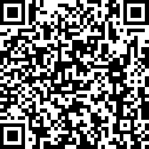

# Cryptaxation
## Background
Cryptaxation in its current form is used to generate completed Swedish tax forms, for trades made on Bitstamp, but if the CSV files with transactions from another exchange are adapted to Bitstamp’s format, that should work as well. Without some program to do generate these forms, it becomes very burdensome to calculate all relevant values, and to fill in all the K4 PDFs.

The first version of Cryptaxation was finished 2018, in time for the tax declaration. The project was initiated in a hurry and was built for own use in order to submit a correct tax declaration in time that year. It was used by a handful of people, and all the tax declarations were accepted by Skatteverket.
Cryptaxation uses Adobe Acrobat Reader to fill in the K4 forms, which technically definitely isn’t the best solution, but works for now.

Please note that Cryptaxation is a tool to fill in K4 forms, but it doesn’t take any responsibility for errors. Please use it with caution!

## Donation
If Cryptaxation helped you out, why not make a donation to show your gratitude? It’s definitely a motivator for future improvements. 
### Bitcoin address as QR code:

### Bitcoin address:
32onXJMvZeFA8rp2KY5VC25QqKKxNiMZEp

## Limitations
* Supports SEK, USD, EUR, BTC, ETH and LTC
* Current version only has Skatteverkets K4 forms from 2014 to 2019
* Rates from Riksbanken until 2020-03-28, so if you have made trades after that, delete them from the transactions CSV

## Requirements
The program might work with other versions, but it’s tested with these:
* Windows 10
* Acrobat Reader must be set as the default application for PDFs. It is used when filling in the forms. It has only been tested with version 2018.011.20035 and 2019.010.20098, but most new versions should work
* .NET Framework 4.6.1 or newer

## Guide
### Prerequisite
1. Download and install Adobe Acrobat Reader (2019.010.20098)
2. Set Adobe Acrobat Reader as the default application for PDFs
3. Download and install .NET Framework (4.6.1)
4. Download the whole transaction history that you want to use. It should be a CSV-file with the format explained in the [Fields explanation](#Fields-explanation) section. There is also an example file in /Resources/Examples
5. Make sure not to have anything of importance open when running Cryptaxation since it will “press” the keys in order to fill the forms with Adobe Acrobat Reader. If something goes wrong, it could write the form data somewhere else or even close other programs.

### Step by step
1. Open Cryptaxation.GUI.exe
2. Fill in the full name and the personal identification number. It will be used when filling in Skatteverkets K4 forms.
3. Browse the transaction history CSV-file that you want to use.
4. If you want to use rates from other sources, browse these files. The included files rates are taken from Riksbanken and Bitstamp.
5. Pick an output path where the filled forms, detailed transactions.csv and report.csv will placed.
6. Pick which years you want to fill K4 forms for. The Detailed transactions.csv and Yearly report.csv will be created for all the data.
7. Press the Execute button and make sure not to press any keys until Cryptaxation informs it’s done. It might take a while.
8. It’s a good idea to check if the filled K4 forms looks correct.
9. If you want to know how much tax you will pay, you can find a summary for every year in the Yearly report.csv.

## Fields explanation
* Full name -
The name that will be written in the forms.
* Personal identification number -
The personal identification number that will be written in the forms. All formats is allowed.
* Process name -
The name of the Adobe Acrobat Reader process in Windows. The default value is Acrord32.exe.
* Transactions path -
A path to a CSV file containing the transactions. The file must use comma as separator and must follow the order of the list below.
  1. Type - Must be: **Deposit, Withdrawal or Market**
  2. Datetime - Must be in format: **MMM. dd, yyyy, hh:mm tt**
  3. Account - The name of the account. It doesn't affect anything
  4. Amount - The amount that was bought/sold. Must be in format: **0.01000000 BTC**
  5. Value - The value of the amount that was bought/sold. Must be in format: **7.88 USD**
  6. Rate - The price of on unit of the amount. Must be in format: **620.89 USD**
  7. Fee - Must be in format: **0.06 USD**
  8. Action -  Must be: **Buy or Sell**

  Example of a transaction: Market,"Feb. 15, 2014, 13:52 PM",Main Account,0.01000000 BTC,7.77 USD,777.05 USD,0.04 USD,Buy
* Fiat rates path -
A path to a CSV file containing the rates for fiat currencies (SEK, USD and EUR). The file must use comma as separator and must follow the order of the list below.
  1. Date - Must be in format: **yyyy-MM-dd**
  2. 1 SEK = ? USD - Must be in format: **0.1544**
  3. 1 USD = ? SEK - Must be in format: **6.4767**
  4. 1 SEK = ? EUR - Must be in format: **0.1125**
  5. 1 EUR = ? SEK - Must be in format: **8.8855**
* Crypto to fiat rates path -
A path to a CSV file containing the crypto to fiat rates (BTC to USD). The file must use comma as separator and must follow the order of the list below.
  1. Date - Must be in format: **yyyy-MM-dd**
  2. 1 BTC = ? USD - Must be in format: **0.06**

## Future plans
* Replace the Adobe Acrobat Reader solution with a much more smoother solution
* Build it with .NET Core so it will work for Linux users
* Somehow get the rates in a better way

## Contact
If you want to contact us, please use this email:
cryptaxation@protonmail.com

## License
MIT License

Copyright (c) [2020] [Cryptaxation]

Permission is hereby granted, free of charge, to any person obtaining a copy
of this software and associated documentation files (the "Software"), to deal
in the Software without restriction, including without limitation the rights
to use, copy, modify, merge, publish, distribute, sublicense, and/or sell
copies of the Software, and to permit persons to whom the Software is
furnished to do so, subject to the following conditions:

The above copyright notice and this permission notice shall be included in all
copies or substantial portions of the Software.

THE SOFTWARE IS PROVIDED "AS IS", WITHOUT WARRANTY OF ANY KIND, EXPRESS OR
IMPLIED, INCLUDING BUT NOT LIMITED TO THE WARRANTIES OF MERCHANTABILITY,
FITNESS FOR A PARTICULAR PURPOSE AND NONINFRINGEMENT. IN NO EVENT SHALL THE
AUTHORS OR COPYRIGHT HOLDERS BE LIABLE FOR ANY CLAIM, DAMAGES OR OTHER
LIABILITY, WHETHER IN AN ACTION OF CONTRACT, TORT OR OTHERWISE, ARISING FROM,
OUT OF OR IN CONNECTION WITH THE SOFTWARE OR THE USE OR OTHER DEALINGS IN THE
SOFTWARE.

